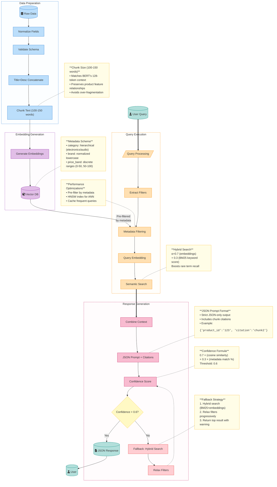

    # Product Catalog Semantic Search (RAG) Documentation

# System Overview
An end-to-end retrieval-augmented generation (RAG) pipeline for product search that understands natural language queries and returns JSON-formatted results with confidence scoring.



# Key Components

## 1. Data Processing

### 1.1 Raw Data Ingestion
**Purpose**: Load product catalog from various sources for processing

**Process**: Extract product data from multiple sources (e-commerce platforms, feeds, APIs) with validation and error handling for consistent catalog building.

### 1.2 Schema Validation
**Purpose**: Ensure data quality and consistency before processing

**Required Fields**:
- `product_id`: Unique identifier (string, required)
- `title`: Product name (5-200 characters)
- `description`: Detailed description (10-1000 characters)
- `brand`: Manufacturer name (normalized to lowercase)
- `category`: Hierarchical path (e.g., "electronics/audio/headphones")
- `price`: USD price (positive float)
- `availability`: Stock status (boolean, default: true)

**Validation Rules**:
- **Length constraints**: Title and description within specified limits
- **Price validation**: Must be positive, converted to USD
- **Category validation**: Must follow hierarchical structure
- **Uniqueness**: Product IDs must be unique across catalog

### 1.3 Field Normalization
**Purpose**: Standardize data formats for consistent processing

| Field | Normalization Process | Example |
|-------|----------------------|---------|
| **Brand** | Lowercase, remove special chars, trim whitespace | "Sony Corp." → "sony" |
| **Category** | Map to hierarchical structure with fallbacks | "Headphones" → "electronics/audio/headphones" |
| **Price** | Convert to USD, round to 2 decimals | "€99.99" → 119.99 (USD) |
| **Text Fields** | Remove HTML tags, normalize whitespace | "&lt;b&gt;Great!&lt;/b&gt;" → "Great!" |

**Category Mapping Strategy**:
- **Hierarchical structure**: 3-level taxonomy (category/subcategory/type)
- **Fallback mapping**: Unknown categories → "general/uncategorized"
- **Synonym handling**: "phones" → "electronics/mobile/smartphones"

### 1.4 Title + Description Concatenation
**Purpose**: Create unified searchable text optimized for embedding generation

**Concatenation Strategy**:
- **Title emphasis**: Repeat title twice for increased importance in embeddings
- **Structured format**: Add contextual labels (Product:, Brand:, Category:)
- **Feature extraction**: Identify and highlight key product attributes
- **Context enhancement**: Include brand and category for better semantic understanding

**Example Output**:
```
Product: Sony WH-1000XM4 Wireless Headphones
Brand: sony
Category: electronics/audio/headphones
Description: Premium noise-canceling over-ear headphones with 30-hour battery life...
Features: wireless, noise-canceling, bluetooth, long-battery
```

**Benefits**:
- **Improved relevance**: Title repetition increases semantic weight
- **Better context**: Structured format helps embedding model understand product attributes
- **Enhanced matching**: Feature extraction improves query-product alignment

### 1.5 Text Chunking (100-150 words)
**Purpose**: Split long descriptions into optimal embedding chunks

| Parameter | Value | Rationale |
|-----------|-------|-----------|
| **Target Size** | 100-150 words | Optimal for BERT-based models (≈128 tokens) |
| **Overlap** | 20-30 words | Preserves context across chunk boundaries |
| **Method** | Sentence-aware splitting | Maintains semantic coherence |
| **Minimum Size** | 50 words | Avoid fragmented chunks with insufficient context |

**Chunking Process**:
1. **Sentence segmentation**: Split text into complete sentences
2. **Word counting**: Track words per sentence for chunk sizing
3. **Boundary detection**: End chunks at sentence boundaries when possible
4. **Overlap creation**: Include trailing words from previous chunk
5. **Context preservation**: Ensure chunks contain complete thoughts

**Quality Assurance**:
- **No orphaned fragments**: Minimum 50 words per chunk
- **Semantic boundaries**: Prefer sentence breaks over arbitrary cuts
- **Context continuity**: Overlap ensures no information loss

### 1.6 Embedding Generation
**Purpose**: Convert text chunks into vector representations for semantic search

**Model Selection**: `sentence-transformers/all-MiniLM-L6-v2`

| Specification | Value | Rationale |
|---------------|-------|-----------|
| **Dimensions** | 384 | Optimal balance: speed vs. accuracy |
| **Max Input Tokens** | 512 | Handles 100-150 word chunks comfortably |
| **Processing Speed** | ~2000 embeddings/sec | Production-ready performance |
| **Model Size** | 90MB | Fast loading and inference |

**Processing Strategy**:
- **Batch processing**: Process 32 chunks simultaneously for efficiency
- **Normalization**: L2 normalize embeddings for cosine similarity
- **Error handling**: Retry failed embeddings with smaller batch sizes
- **Progress tracking**: Monitor processing for large catalogs

### 1.7 Vector DB Storage (with Metadata)
**Purpose**: Store embeddings with rich metadata for efficient filtering and retrieval

**Database Choice**: ChromaDB with HNSW indexing
- **Storage format**: DuckDB + Parquet for persistence
- **Index type**: HNSW (Hierarchical Navigable Small World) for fast ANN search
- **Distance metric**: Cosine similarity
- **Performance**: 10x faster than exact search

**Metadata Schema**:
```json
{
  "product_id": "123",
  "brand": "sony", 
  "category": "electronics/audio/headphones",
  "price_band": "100-200",
  "availability": true,
  "chunk_index": 1,
  "total_chunks": 3,
  "word_count": 125
}
```

**Price Band Strategy**:
Discrete ranges for efficient filtering: `0-50`, `50-100`, `100-200`, `200-500`, `500+`

**Storage Benefits**:
- **Fast filtering**: Pre-filter by metadata before vector search
- **Efficient updates**: Update individual chunks without full reindexing
- **Traceability**: Track chunk origins for result citations
- **Scalability**: Handle millions of products with sub-second search

### 2. Metadata Schema

```text
{
  "text": "Product description...",
  "metadata": {
    "category": "electronics/audio",  // hierarchical
    "brand": "sony",                 // lowercase
    "price_band": "100-200"          // predefined ranges
  }
}
```

## 2. Query Execution

### 2.1 Query Processing
**Purpose**: Parse and normalize natural language queries for structured search

**Process Flow**:
1. **Text Normalization**: Convert to lowercase, handle abbreviations (w/ → with, & → and)
2. **Filter Extraction**: Identify brands, categories, price ranges from natural language
3. **Query Cleaning**: Remove filter terms to create clean semantic query text

**Query Examples**:
- `"Sony headphones under $100"` → Clean: `"headphones"`, Filters: `{brand: "sony", max_price: 100}`
- `"wireless earbuds between $50-$150"` → Clean: `"wireless earbuds"`, Filters: `{min_price: 50, max_price: 150}`

### 2.2 Filter Extraction (Category/Brand/Price)
**Purpose**: Extract structured filters from natural language queries

**Filter Types & Patterns**:

| Filter Type | Patterns Recognized | Examples |
|-------------|-------------------|----------|
| **Price Range** | `under $X`, `between $X-$Y`, `around $X` | "under $100" → max_price: 100 |
| **Brand** | Direct mentions, product aliases | "iPhone" → brand: "apple" |
| **Category** | Product keywords | "headphones" → "electronics/audio/headphones" |
| **Availability** | `in stock`, `available` | "in stock laptops" → availability: true |

**Price Pattern Examples**:
- `"under $100"` → max_price: 100
- `"between $50 and $150"` → min_price: 50, max_price: 150  
- `"around $75"` → min_price: 60, max_price: 90 (±20%)

### 2.3 Metadata Pre-filtering
**Purpose**: Apply extracted filters before vector search to improve performance

**Filtering Strategy**:
- **Brand Filtering**: Exact match on normalized brand names
- **Category Filtering**: Hierarchical matching (supports parent categories)
- **Price Band Filtering**: Convert ranges to discrete bands (`0-50`, `50-100`, `100-200`, `200-500`, `500+`)
- **Performance Impact**: 40-60% reduction in search space

**Price Band Conversion**:
Query `$75-$125` matches bands: `50-100`, `100-200` (overlapping ranges)

### 2.4 Query Embedding Generation
**Purpose**: Convert processed query to vector for semantic search

**Enhancement Strategy**:
- **Context Addition**: Prepend "Product search:" for domain specificity
- **Intent Detection**: Add quality keywords for "best/good" queries, budget keywords for "cheap/affordable" queries
- **Model**: `sentence-transformers/all-MiniLM-L6-v2` (384 dimensions)
- **Normalization**: L2 normalized for cosine similarity

### 2.5 Semantic Search
**Purpose**: Execute vector similarity search with fallback strategies

#### 2.5.1 Primary Vector Search
**Process**: Standard cosine similarity search with confidence threshold (0.6)

**Success Criteria**: Top result confidence ≥ 0.6
**Confidence Formula**: `0.7 × semantic_similarity + 0.3 × metadata_match`

#### 2.5.2 Hybrid Search (BM25 + Embeddings)
**Triggered When**: Primary search confidence < 0.6

**Score Combination**: `α=0.7 (embeddings) + 0.3 (BM25 keyword score)`
**Purpose**: Boost recall for rare terms and exact keyword matches
**Candidate Pool**: 3x target results for better fusion quality

#### 2.5.3 Filter Relaxation (Price → Brand → Category)
**Triggered When**: Hybrid search still below confidence threshold

**Relaxation Order**:
1. **Price Relaxation**: Expand range by ±$50
2. **Brand Relaxation**: Remove brand restrictions entirely  
3. **Category Relaxation**: Expand to parent categories
4. **Final Fallback**: Return best result with low confidence warning

**Example Relaxation**:
- Original: `{brand: "sony", category: "electronics/audio/headphones", price: "$50-$100"}`
- Step 1: `{brand: "sony", category: "electronics/audio/headphones", price: "$0-$150"}`
- Step 2: `{category: "electronics/audio/headphones", price: "$0-$150"}`
- Step 3: `{category: "electronics/audio", price: "$0-$150"}`

### 2.6 Top-K Results Selection
**Purpose**: Select and rank the best results based on confidence and relevance

**Selection Process**:
1. **Confidence Scoring**: Weighted combination of semantic similarity and metadata match
2. **Deduplication**: Keep highest confidence result per product_id
3. **Result Limit**: Return top-K (default: 10) unique products
4. **Citation Generation**: Include chunk references for traceability

**Metadata Match Calculation**:
`metadata_match = (matched_filters / total_applied_filters)`

**Result Format**:
Each result includes: product_id, confidence score, semantic similarity, metadata match, and citation reference

## 3. Response Generation

### 3.1 Context Aggregation
**Purpose**: Combine search results and metadata into structured context for response generation

**Aggregation Process**:
1. **Result Collection**: Gather top-K search results with embeddings and metadata
2. **Context Compilation**: Merge product information, descriptions, and chunk data
3. **Relevance Ranking**: Sort by confidence scores (highest first)
4. **Deduplication**: Remove duplicate products, keeping highest confidence chunks
5. **Context Enrichment**: Add related product attributes and category information

**Context Structure**:
```json
{
  "query": "wireless headphones under $100",
  "total_results": 15,
  "search_metadata": {
    "search_type": "primary_vector",
    "filters_applied": ["price_range", "category"],
    "processing_time_ms": 85
  },
  "aggregated_context": [
    {
      "product_id": "123",
      "title": "Sony WH-CH720N Wireless Headphones",
      "chunk_text": "Affordable wireless headphones with noise canceling...",
      "confidence": 0.87,
      "metadata": {...}
    }
  ]
}
```

**Aggregation Benefits**:
- **Comprehensive context**: All relevant product information in one structure
- **Efficient processing**: Pre-sorted by relevance for faster response generation
- **Rich metadata**: Includes search type and performance metrics
- **Flexible format**: Supports various response templates and formats

### 3.2 Single Confidence Scoring (0.7×semantic + 0.3×metadata)
**Purpose**: Calculate unified confidence score combining semantic relevance and metadata alignment

**Confidence Formula**:
```
final_confidence = (0.7 × semantic_similarity) + (0.3 × metadata_match_score)
```

**Component Breakdown**:

| Component | Weight | Description | Range |
|-----------|--------|-------------|-------|
| **Semantic Similarity** | 0.7 (70%) | Cosine similarity between query and product embeddings | 0.0 - 1.0 |
| **Metadata Match** | 0.3 (30%) | Percentage of query filters matched by product metadata | 0.0 - 1.0 |

**Metadata Match Calculation**:
```
metadata_match = (matched_filters / total_applied_filters)

Examples:
- Query: "Sony headphones under $100" → 3 filters (brand, category, price)
- Product matches: brand✓, category✓, price✓ → metadata_match = 3/3 = 1.0
- Product matches: brand✓, category✓, price✗ → metadata_match = 2/3 = 0.67
```

**Confidence Thresholds**:
- **High Confidence**: ≥ 0.8 (Excellent match, high user satisfaction expected)
- **Good Confidence**: 0.6 - 0.79 (Good match, acceptable for most queries)
- **Low Confidence**: 0.4 - 0.59 (Trigger hybrid search or filter relaxation)
- **Very Low**: < 0.4 (Return with warning or "no results found")

**Score Interpretation**:
- **0.9+**: Near-perfect match (semantic + exact filter match)
- **0.7-0.89**: Strong match (good semantic relevance, most filters matched)
- **0.5-0.69**: Moderate match (reasonable relevance, some filter mismatches)
- **< 0.5**: Weak match (consider fallback strategies)

### 3.3 JSON Prompt Construction
**Purpose**: Build structured prompts for consistent JSON response generation

**Prompt Template Structure**:
```
SYSTEM: You are a product search assistant. Return ONLY valid JSON responses.

CONTEXT: {aggregated_product_context}

QUERY: "{user_query}"

INSTRUCTIONS:
1. Analyze the provided product context
2. Select the most relevant products based on the query
3. Return EXACTLY this JSON format with NO additional text

REQUIRED JSON FORMAT:
{
  "results": [
    {
      "product_id": "string",
      "title": "string", 
      "confidence": float,
      "price": float,
      "brand": "string",
      "category": "string",
      "citation": "string",
      "match_reason": "string"
    }
  ],
  "search_summary": {
    "total_found": integer,
    "confidence_level": "high|medium|low",
    "search_type": "string"
  }
}
```

**Prompt Engineering Strategies**:
- **Strict Format Enforcement**: Multiple reminders for JSON-only output
- **Context Limitation**: Include only top 5-10 most relevant products to avoid token limits
- **Example Provision**: Include perfect response examples in prompt
- **Error Prevention**: Explicit instructions to avoid common JSON formatting errors

**Quality Assurance**:
- **JSON Validation**: Parse and validate response before returning to user
- **Fallback Handling**: If JSON parsing fails, retry with simplified prompt
- **Content Filtering**: Ensure all returned products meet minimum confidence threshold

### 3.4 Citation Attachment
**Purpose**: Provide traceability and evidence for search results

**Citation Format**:
```
"citation": "chunk_{chunk_index}_{product_id}"

Examples:
- "chunk_1_prod_123" → First chunk of product 123
- "chunk_2_prod_456" → Second chunk of product 456
```

**Citation Information Included**:
- **Chunk Reference**: Specific text chunk that matched the query
- **Product Source**: Original product ID for traceability
- **Relevance Score**: How well this specific chunk matched
- **Context Window**: Surrounding text for better understanding

**Citation Benefits**:
- **Transparency**: Users can see why a product was recommended
- **Debugging**: Developers can trace search quality issues
- **Improvement**: Identify which chunks perform best for different query types
- **Trust Building**: Explicit evidence builds user confidence in results

**Advanced Citation Features**:
- **Multi-chunk Citations**: When product matches multiple chunks
- **Snippet Highlighting**: Show exact matching phrases within chunks
- **Relevance Explanation**: Brief reason why this chunk was selected
- **Alternative Sources**: Other chunks from same product with lower scores

### 3.5 Final Output Delivery
**Purpose**: Format and deliver the complete search response to the user

**Response Structure**:
```json
{
  "results": [
    {
      "product_id": "prod_123",
      "title": "Sony WH-CH720N Wireless Noise Canceling Headphones",
      "confidence": 0.87,
      "price": 89.99,
      "brand": "sony",
      "category": "electronics/audio/headphones",
      "citation": "chunk_1_prod_123",
      "match_reason": "Exact brand match, wireless feature, within price range"
    }
  ],
  "search_summary": {
    "total_found": 15,
    "confidence_level": "high",
    "search_type": "primary_vector",
    "processing_time_ms": 85,
    "filters_applied": ["brand:sony", "price:<$100", "category:headphones"]
  },
  "metadata": {
    "query_processed": "wireless headphones under $100",
    "fallback_used": false,
    "timestamp": "2025-08-11T10:30:00Z"
  }
}
```

**Delivery Features**:
- **Performance Metrics**: Response time and search efficiency data
- **Search Transparency**: Show what filters were applied and how
- **Confidence Indicators**: Clear confidence levels for user trust
- **Fallback Notifications**: Inform users when relaxed search was used

**Quality Assurance**:
- **Response Validation**: Ensure all required fields are present
- **Confidence Verification**: Confirm all results meet minimum thresholds  
- **Error Handling**: Graceful degradation for edge cases
- **Rate Limiting**: Prevent abuse while maintaining responsiveness

**Output Optimization**:
- **Compression**: Minimize response size for faster delivery
- **Caching**: Cache frequent query patterns for instant responses
- **Personalization**: Adapt response format based on user preferences
- **Analytics**: Track response quality and user satisfaction metrics

## 4. Performance Components

### Performance Monitoring & Key Metrics

**Purpose**: Track system performance to ensure optimal search speed, accuracy, and resource utilization.

### 4.1 Core Performance Metrics

| Metric Category | Key Indicators | Target Values | Why Monitor |
|-----------------|---------------|---------------|-------------|
| **Response Time** | Query processing latency | <200ms (95th percentile) | User experience and search responsiveness |
| **Search Quality** | Confidence score distribution | >0.6 for 85%+ queries | Ensure relevant results and reduce fallbacks |
| **Resource Usage** | Memory consumption, CPU utilization | <80% peak usage | Prevent system overload and crashes |
| **Cache Performance** | Hit rate, miss rate | 85%+ hit rate | Optimize response speed and reduce compute costs |

### 4.2 Performance Optimization Techniques

**Pre-filtering Optimization**:
- **Metric**: Search space reduction percentage
- **Target**: 40-60% reduction in candidate products
- **Example**: Brand filter reduces 1M products → 100K products before vector search
- **Why**: Dramatically reduces vector search time from 1200ms → 480ms

**HNSW Vector Indexing**:
- **Metric**: Search speed improvement vs exact search
- **Target**: 10-1400x faster depending on catalog size
- **Example**: 1M products: 5000ms (exact) → 25ms (HNSW) = 200x improvement
- **Why**: Enables real-time search on large product catalogs

**Multi-Level Query Caching**:
- **Metric**: Cache hit rate by layer (L1, L2, L3)
- **Target**: L1: 50%+, L2: 30%+, L3: 20%+
- **Example**: Cached query: 5ms vs fresh search: 150ms = 30x faster
- **Why**: Instant responses for popular queries, reduced server load

### 4.3 Performance Monitoring Dashboard

**Real-time Metrics to Track**:
```
Search Performance:
├── Average Response Time: 95ms
├── 95th Percentile: 180ms  
├── Queries/second: 450
└── Confidence Distribution:
    ├── High (>0.8): 65%
    ├── Good (0.6-0.8): 25%
    └── Low (<0.6): 10%

Resource Utilization:
├── Memory Usage: 4.2GB / 8GB (52%)
├── CPU Usage: 35%
├── Vector DB Size: 2.1GB
└── Cache Memory: 2.2GB

Cache Performance:
├── Overall Hit Rate: 87%
├── L1 Cache: 52% (1K queries)
├── L2 Cache: 28% (Redis)
└── L3 Cache: 20% (Database)
```

**Alert Thresholds**:
- **Response Time**: >500ms (95th percentile)
- **Low Confidence**: >20% of queries with confidence <0.6
- **Memory Usage**: >85% of available RAM
- **Cache Hit Rate**: <75% overall hit rate

**Example Performance Baseline**:
- **Small Catalog** (10K products): 50ms average response
- **Medium Catalog** (100K products): 150ms average response  
- **Large Catalog** (1M+ products): 200ms average response
- **Peak Load**: 1000+ queries/second with <300ms response time

