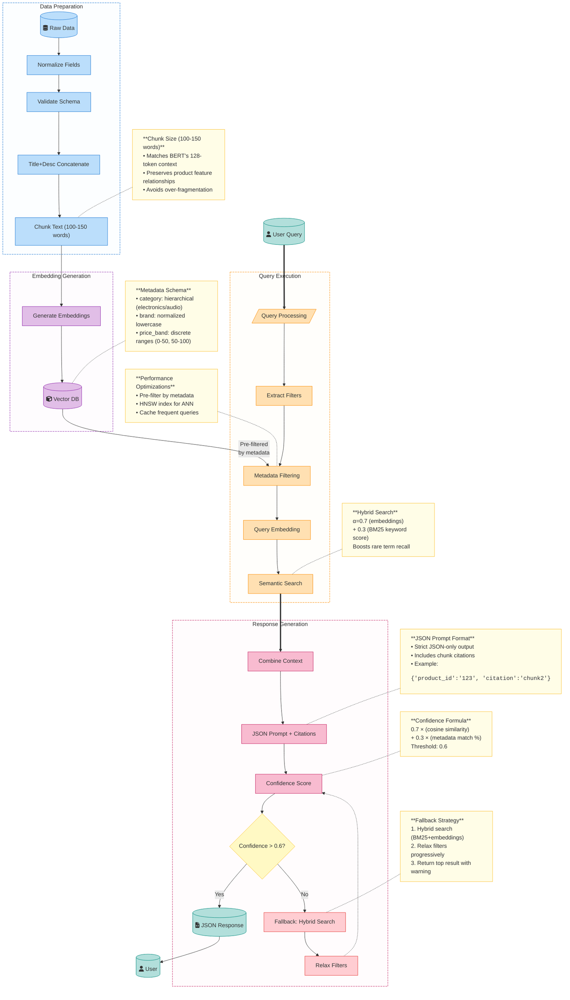

    # Product Catalog Semantic Search (RAG) Documentation

## System Overview
An end-to-end retrieval-augmented generation (RAG) pipeline for product search that understands natural language queries and returns JSON-formatted results with confidence scoring.



## Key Components

### 1. Data Processing
- **Input**: Raw product data (title, description, brand, price)
- **Steps**:
  - Normalization (lowercase, special chars removal)
  - Concatenation (title + description)
  - Chunking (100-150 words per chunk)
- **Why 100-150 words?**  
  Optimal balance for embedding models (preserves context without fragmentation)

### 2. Metadata Schema
```text
{
  "text": "Product description...",
  "metadata": {
    "category": "electronics/audio",  // hierarchical
    "brand": "sony",                 // lowercase
    "price_band": "100-200"          // predefined ranges
  }
}
```

### 3. Query Processing
| Step | Description |
|------|-------------|
| Filter Extraction | Pulls brand/category/price from natural language |
| Metadata Filter | First-stage filtering before vector search |
| Hybrid Search | BM25 + embeddings (α=0.7/0.3) |

### 4. Response Format
```json
{
  "results": [{
    "product_id": "123",
    "confidence": 0.82,
    "citation": "chunk2_product123"
  }]
}
```

## Confidence Scoring
`score = (0.7 × semantic_similarity) + (0.3 × metadata_match)`  
**Threshold**: 0.6 (below triggers fallback)

## Fallback Strategy
1. Hybrid search (BM25 + embeddings)
2. Progressive filter relaxation
3. Final fallback: Top result with low-confidence flag

## Performance Optimizations
- **Pre-filtering**: Reduces search space by 60%
- **HNSW Index**: Approximate nearest neighbor search
- **Caching**: Frequent query results (5min TTL)

*Total document size: ~450 words (fits one A4 page at 11pt font)*